## GoAccess

## Сводная информация в терминале

- 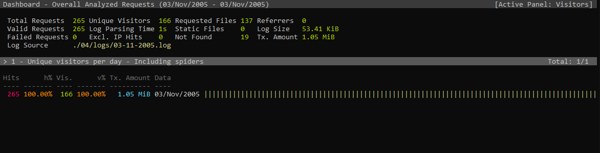  
*Число уникальных ползователей за день*

- 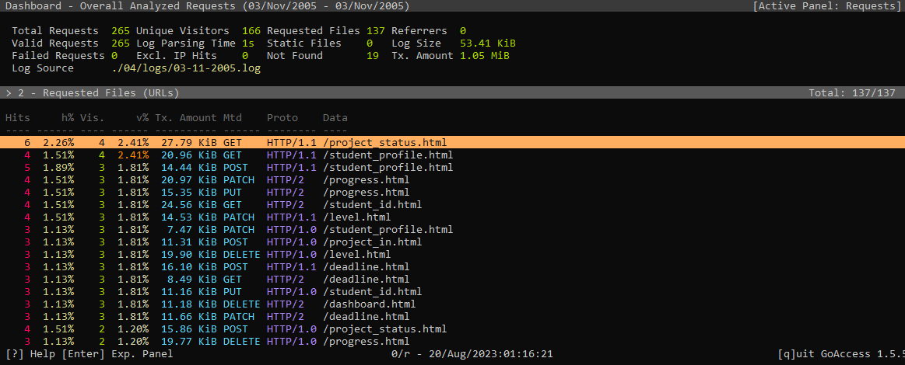  
*URLs*

- 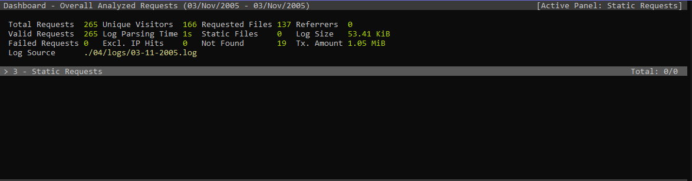  
*Статический запрос*

- 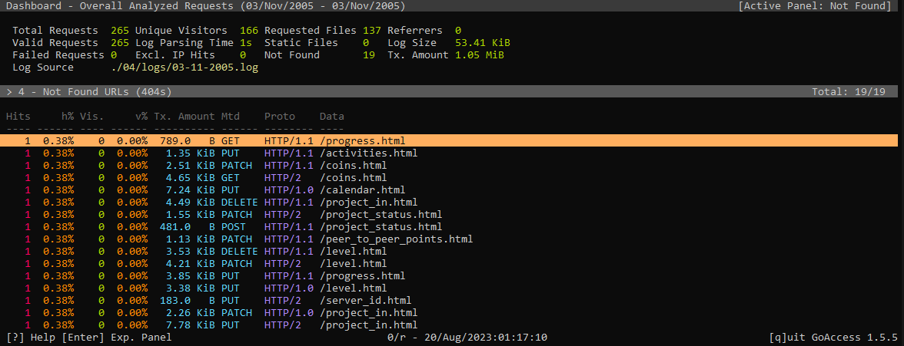  
*Запросы с ошибкой 404*

- 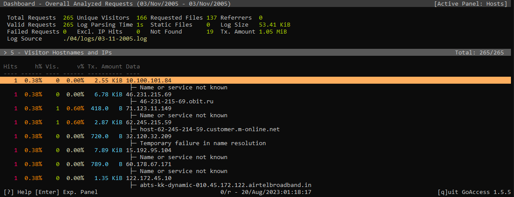  
*IPs*

- 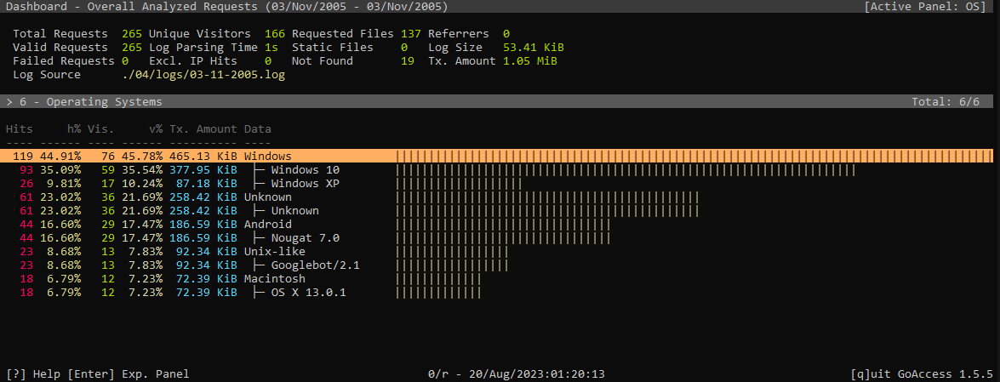  
*ОС*

- 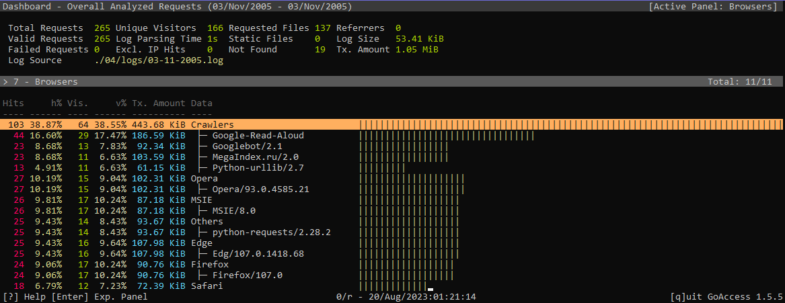  
*Браузеры/агенты*

- 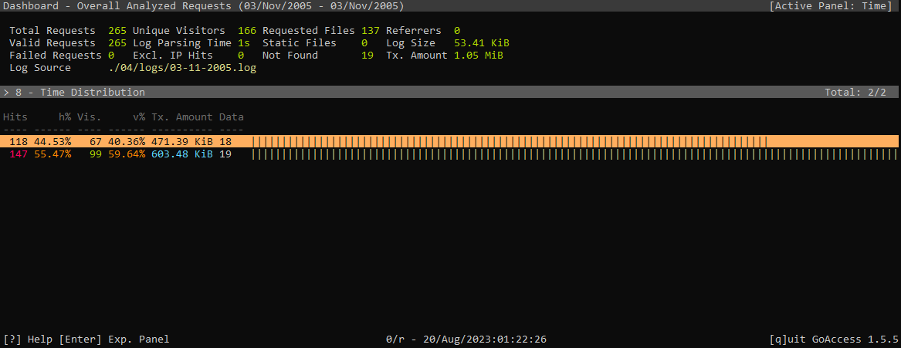  
*Распределение времени*

-   
*Распредение по статусам*

## HTML DashBoard

- 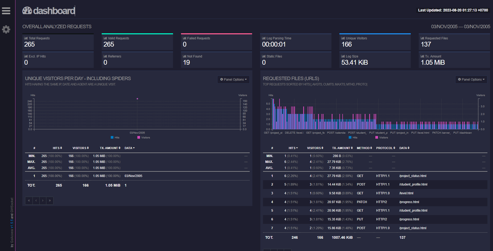
- 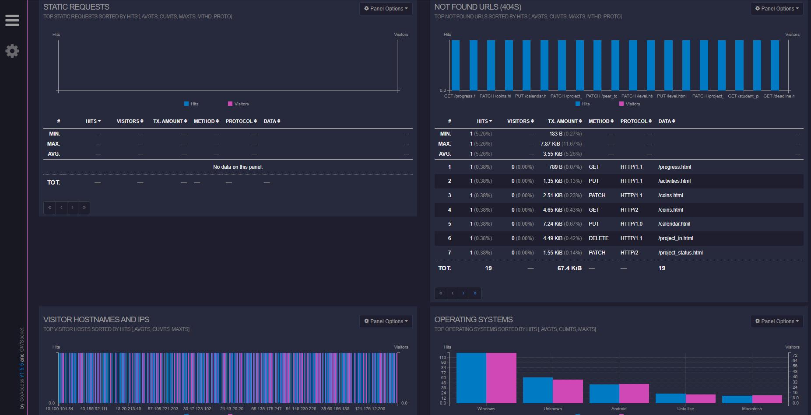
- 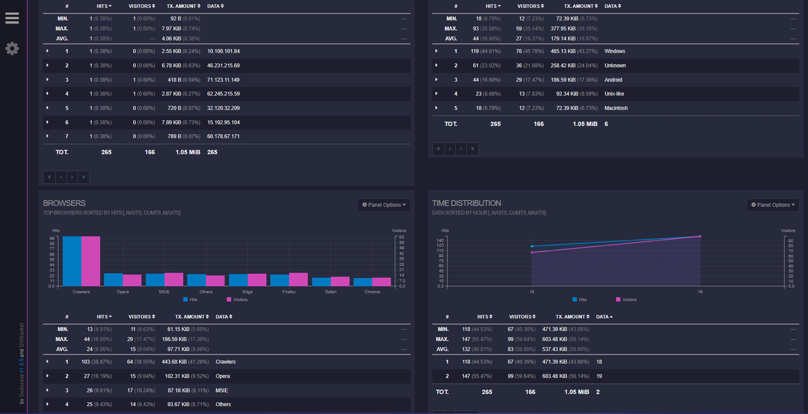
- 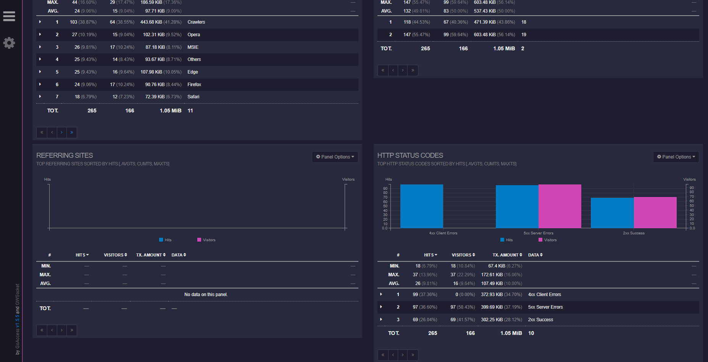
