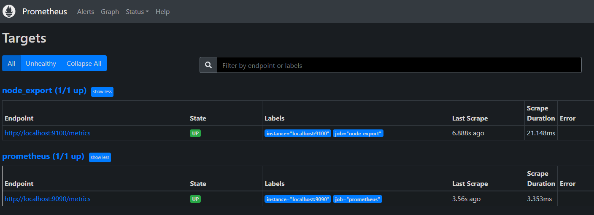
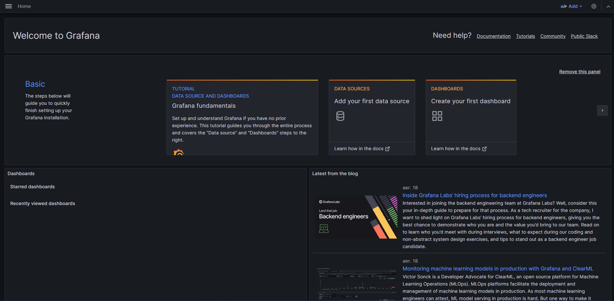

## Part 7

### Prometheus

- Скачиваем архив для установки  

- Разархивируем  

- Распределяем файлы по каталогам  
  
  

- Для конфигурационных файлов необходимо создать папку /etc/prometheus  

- Скопируем туда такие папки с конфигурационными файлами  
В них содержатся файлы для работы веб-интерфейса программы  

- Создадим конфигурационный файл /etc/prometheus/prometheus.yml  
  
  
По умолчанию интервал сбора данных составляет 15 секунд, а также добавлена задача по сборку данных с самого Prometheus.

- Создаем пользователя, от которого будем запускать систему мониторинга  
  
Мы создали пользователя prometheus без домашней директории и без возможности входа в консоль сервера.

- Создаем файл prometheus.service  
  
Указываем путь к настройкам, к данным prometheus, адрес и порт и задаем возможность изменения конфигурации без необходимости рестарта сервиса  

- Разрешаем автозапуск  

- Задаем владельца для каталогов  
  
  

- Запускаем сервис и смотрим статус  

- Веб-интерфейс Prometheus:  

### Установка Node Exporter:

_Node Exporter используется для сбора информации о Linux, например загрузка процессора, системные метрики._

- Создаём системного пользователя:  

- Скачиваем Node Exporter:  

- Извлекаем:  

 
- Перемещаем все файлы:  

- Проверяем версию:  

- Задаём параметры сервиса:  

- Запускаем и проверяем:  

- Создаём static target:  

- Два экземпляра node_exporter:

### Установка Grafana:

- Убедимся, что зависимости установлены:  

- Получаем ключ:  

- Подключаем репозиторий для grafana:  

- Устанавливаем grafana:  

- Устанавливаем grafana-agent:  

- Разрешаем автозапуск и запускаем grafana-server:  

- Смотрим web-интерфейс grafana:  

- Обновляем правила, разрешающие доступ к localhost на 3000 порту:  

- Выводим на dashboard информацию о загрузке ЦПУ, доступной оперативной памяти, свободное место и кол-во операций ввода/вывода на жестком диске:  

- Запуск скрипта из второй части:  

- Запуск стресс-теста:  
  

